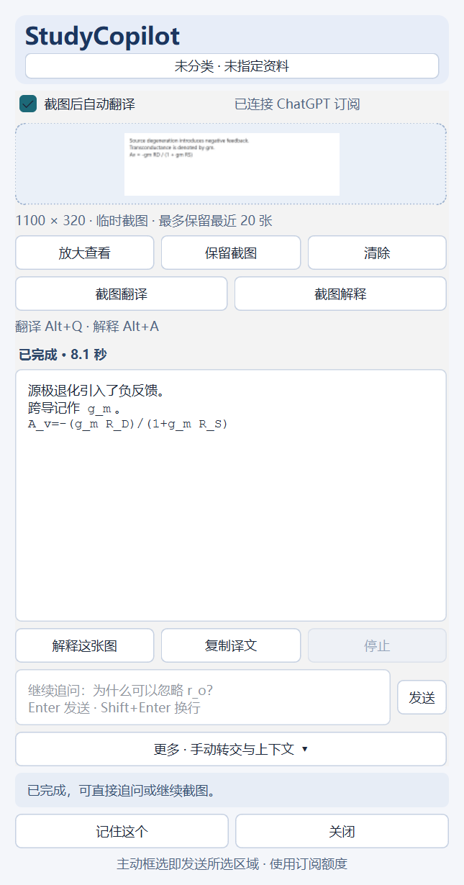

# StudyCopilot V0.3.1

Windows 学习阅读侧栏：**按截图快捷键 → 框选并松开 → 在侧栏直接读译文**。无需复制图片、复制说明或切到聊天窗口；支持正文、公式、表格和电路截图，不需要 OCR。

项目、资料与学习记忆保存在本地。开启「截图后自动翻译」时，主动框选的图片和当前项目必要上下文会发送给已连接的 ChatGPT 订阅服务，消耗对应的 Codex 额度。不会自动购买额度或切换到付费 API。

原始需求已保存：[总任务](PROJECT_TASK.md)、[V0.2](PROJECT_TASK_V0.2.md)、[V0.3 框选即翻译](PROJECT_TASK_V0.3.md)。

## 版本概览

当前版本 **0.3.1** · Windows · Python 3.11+ · SQLite schema v3 · 137 项本地测试通过。

[当前状态](docs/STATUS.md) · [版本记录](CHANGELOG.md) · [文档导航](docs/README.md)

示例使用自制教材图；不是用户私人截图，显示的耗时仅代表该次测试。

## 首次下载与安装

安装 Python 3.11+、Git；自动翻译还需要官方 Codex 与可用的 ChatGPT 登录。

~~~powershell
git clone https://github.com/Farrahhhhh/StudyCopilot.git
cd StudyCopilot
py -3 -m venv .venv
.\.venv\Scripts\python.exe -m pip install -r requirements.txt
.\.venv\Scripts\python.exe -m studycopilot
~~~

仓库已公开，无需登录即可查看或下载源码。也可以从 GitHub 下载 ZIP 并解压，在解压目录中从创建虚拟环境这一步开始。仓库不包含预建 .exe 或虚拟环境。

## 已安装后启动

在项目目录双击 **[Start-StudyCopilot.cmd](Start-StudyCopilot.cmd)**。首次启用也可以在 PowerShell 中运行（下方路径是原开发电脑示例，请改成自己的目录）：

~~~powershell
cd D:\aStudyCopilot
.\.venv\Scripts\python.exe -m studycopilot --enable-auto-translate --reading-model gpt-5.6-luna
~~~

1. 顶部勾选「截图后自动翻译」。已登录官方 Codex 的 ChatGPT 账号可以直接连接。
2. 如果提示未登录，点击顶部项目／资料名称展开设置，点「登录 ChatGPT」，在官方页面完成登录。
3. 打开教材，按界面显示的截图快捷键，拖出矩形后松开。
4. 侧栏显示「正在翻译」，随后逐步显示真实译文。无需点击发送。
5. 输入追问并按 **Enter**；**Shift+Enter** 换行。「解释这张图」直接沿用当前图片。

设置和模型选择会记住。新数据目录默认关闭自动发送；勾选后只对之后主动采集的内容自动处理，不补发已有截图。取消勾选会停止当前生成。手动翻译入口保留在「更多」中。

| 操作 | 默认快捷键 | 被占用时 |
| --- | --- | --- |
| 截图翻译 | Alt+Q | Ctrl+Alt+Q |
| 截图解释 | Alt+A | Ctrl+Alt+A |
| 文字采集 | Alt+Shift+Q | 更多 → 辅助文字 |

**以界面显示为准。** 截图按钮始终可用。Esc／右键取消框选；取消后保留上一张图片和回答。一次在一个显示器内框选，侧栏在截图时暂时隐藏。

## 回答、追问与保存

- 翻译优先保留专业术语、变量、单位和公式，不自动总结或扩写。
- 追问沿用当前图片、最近最多两轮问答和有限的同一资料上下文。新截图清空当前问答；历史截图元数据不代表已发送那些图片。
- 切换项目、资料或 Session 会取消旧请求并隔离结果。没有项目名称、资料或 Topic 也能翻译。
- 「停止」保留已显示的部分文字并明确标记未完成；「重试」重新处理当前内容。不会把失败或部分结果当作翻译成功。
- 「复制译文」只复制已完成回答。正常截图翻译与追问不使用剪贴板。
- 「更多 → 详情与上下文 → 最近截图」可在本次学习中查看已保存回答，不再次发送。
- 选中译文中的一段，再点「记住这个」，可编辑并保存学习记忆；不会自动把整篇回答写入长期记忆。

常用分式、希腊字母、上下标使用可读文本表示；不支持的复杂 LaTeX 保留原始表达，不是完整公式排版器。Markdown 表格、列表、标题可显示，回答中的远程图片与外部链接不自动加载。

## 模型与连接

当前实现使用官方 **Codex App Server**，由官方客户端管理 ChatGPT 登录。已验证 CLI **0.153.4**，本机测试模型 **gpt-5.6-luna**。模型选择来自账号实际公布的视觉模型列表；指定模型失效时提示重新选择，不静默替换。

V0.3.1 修复连续截图重启连接的额外等待，精简模型请求，并显示当前阶段与等待秒数。两次合成目录对照中，精简请求约 **4–8 秒开始显示、7–12 秒完成**；中途换图验证保留了连接。真实服务仍可能更慢，用户曾遇到 29 秒；这些小样本不构成速度保证。详情见 [延迟修复与对照记录](docs/V0.3.1_LATENCY.md)。

- 额度用尽：等额度恢复后重试，不会自动购买或使用 API Key。
- 未连接：展开顶部设置，重新连接或登录。
- 超时／断线：当前图片保留，可以重试。不会隐式循环重发。
- 找不到 Codex：安装官方 Codex 并用 ChatGPT 登录。应用先查找系统命令，再查找 Windows Codex 桌面版安装目录。
- 官方组件仍有实验性接口；升级后如隔离或协议检查不兼容，会停止自动发送并提示更新／重连。

实现与验证证据见 [V0.3 验证记录](docs/V0.3_VALIDATION.md)。官方说明：[App Server](https://learn.chatgpt.com/docs/app-server)、[认证](https://learn.chatgpt.com/docs/auth)。

## 本地数据与升级

~~~text
data/study.db              项目、资料、Session、概念、记忆、截图元数据、最近回答
data/screenshots/         所选区域 PNG 原图
data/backups/             升级前的 SQLite 备份
data/translation-runtime/ 独立阅读连接的运行目录
logs/app.log              事件、内部 ID、错误类型，不记录正文或完整提示
~~~

数据库增量升级到 **schema v3**，新增 reading_results；已有表和用户数据保留。迁移前自动在线备份，事务失败回滚，不删除重建数据库。旧程序无法打开更高版本的数据，请使用对应备份回退，勿覆盖运行中的数据库。

- 临时截图最多保留最近 **20 张**。点击「保留截图」或将其附到 Memory 后不再临时清理。
- 最近已完成回答最多 **60 条**；临时图片清理时连带清理其回答。长期 Memory 不受此上限影响。
- 「清除」移除当前阅读卡片，不删除已保留图片或长期记忆。
- 完整备份：关闭应用后复制整个 **data** 文件夹。单独的数据库备份不包含 PNG。
- 重启后需重新选择项目与资料，上一 Session 不自动恢复。暂未提供长期图片图库或 Memory 编辑／删除界面。

独立数据目录和无快捷键启动：

~~~powershell
.\.venv\Scripts\python.exe -m studycopilot --home D:\MyStudyData
.\.venv\Scripts\python.exe -m studycopilot --no-hotkey
~~~

## 备用方式与隐私

自动发送关闭时保留本地采集。「更多 → 准备给 AI」保留旧版手动交接：复制图片到 ChatGPT／Claude，再复制说明并自行发送；不承诺混合内容一次粘贴。

只响应主动按钮／快捷键，不后台监视屏幕。框选时屏幕图像短暂用于本地遮罩，磁盘仅保存选区。StudyCopilot 不读取 Cookie、认证文件或令牌；官方组件负责认证与模型网络请求。阅读连接关闭工具、MCP、外部应用、shell 和网页检索，采用无工作环境的临时会话，不加载项目开发指令。所发资料依然受所用服务的账户与数据政策约束。

辅助文字采集仍会短暂借用剪贴板，并在安全时尽力恢复支持格式；OLE 私有格式、系统剪贴板历史和极晚的阅读器复制响应不保证恢复。无 OCR、内置 PDF 阅读器、自动总结、云同步或跨项目局部记忆检索。

## 安装与开发验证

需要 Windows 10／11 64 位、Python 3.11+；自动翻译另需官方 Codex、可用 ChatGPT 登录与网络。

~~~powershell
cd D:\aStudyCopilot
py -3 -m venv .venv
.\.venv\Scripts\python.exe -m pip install -r requirements.txt
.\.venv\Scripts\python.exe -m studycopilot
~~~

依赖继续使用 PySide6-Essentials、sqlite3；测试使用 pytest，没有添加 OCR 或模型 SDK。换电脑应重建虚拟环境。完整源码与文档随仓库上传，data、logs、test-results、.venv 和认证信息均不上传。

~~~powershell
.\.venv\Scripts\python.exe -m pytest -q
.\.venv\Scripts\python.exe -m studycopilot --smoke-test --home .\test-results\smoke-v03
~~~

以下是主动的真实模型验证，会发送脚本生成的测试图并消耗订阅额度：

~~~powershell
.\.venv\Scripts\python.exe scripts\verify_reading_ui.py --count 10 --model gpt-5.6-luna
.\.venv\Scripts\python.exe scripts\verify_reading_ui.py --followup --model gpt-5.6-luna
~~~

测试默认使用隔离数据和自制图片。外部 PDF 阅读器、真实多屏与长篇复杂电路的人工验收边界见验证记录。架构：[ARCHITECTURE.md](docs/ARCHITECTURE.md)；开发约束：[AGENTS.md](AGENTS.md)。
